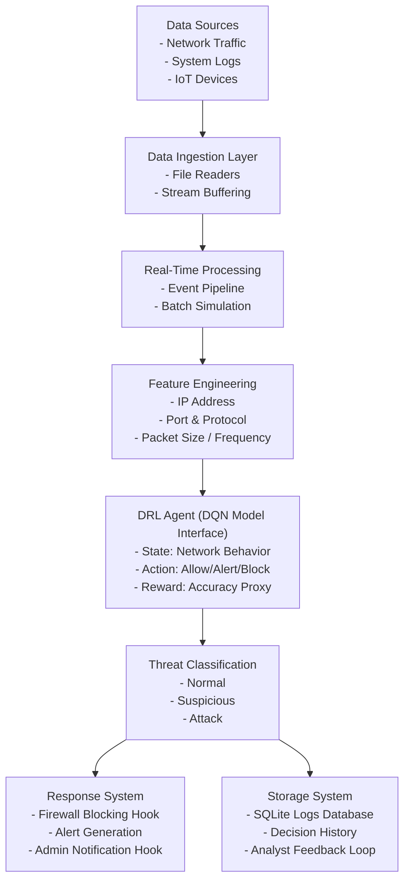

# Real-Time Threat Detection

This project is a local end-to-end threat detection system that ingests security events, engineers features, evaluates them with a DQN-style policy layer, classifies threats, triggers automated responses, and persists results to SQLite for reporting and feedback.

## Architecture



## What Is Included

- Event ingestion from built-in sample traffic, CSV, and JSONL.
- Feature engineering for volume, protocol, and port risk.
- DQN-style policy interface with configurable alert and block thresholds.
- Threat classification into `normal`, `suspicious`, and `attack`.
- Automated response hooks that emit alerts and block actions.
- SQLite persistence for events, decisions, response actions, and analyst feedback.
- Reporting command for recent events and aggregate detection statistics.
- Tests for the pipeline and repository behavior.

## Project Layout

```text
data/                     SQLite database and sample event files
src/threat_detection/
  agents/                 DRL policy layer
  classification/         Threat labeling logic
  features/               Feature engineering
  ingestion/              CSV and JSONL event readers
  processing/             Pipeline orchestration
  response/               Automated response handling
  schemas/                Shared dataclasses
  storage/                SQLite repository and reporting
tests/                    Unit tests
run.py                    Root launcher
```

## Run Commands

From the project root, any of these work:

```powershell
python run.py demo --pretty
python run.py simulate --pretty
python run.py file data/sample_events.jsonl --pretty
python run.py report --pretty
python run.py dashboard --host 127.0.0.1 --port 8000
```

If you prefer module execution:

```powershell
$env:PYTHONPATH="src"
python -m threat_detection.main simulate --pretty
```

## Sample Workflow

1. Run the built-in simulator.
2. Inspect persisted results in the report command.
3. Record analyst feedback for an event ID.

```powershell
python run.py simulate --pretty
python run.py report --pretty
python run.py feedback <event-id> attack --notes "Confirmed malicious SSH burst"
```

## Frontend Dashboard

Launch the frontend with:

```powershell
python run.py dashboard
```

Then open [http://127.0.0.1:8000](http://127.0.0.1:8000).

The dashboard includes:

- live total counts for normal, suspicious, and attack events
- action mix visualization for allow, alert, and block decisions
- protocol volume bars and recent detection trend visualization
- recent event cards with confidence and reasoning
- blocked source IP display
- browser-based CSV and JSONL upload for event ingestion
- automatic refresh every 10 seconds
- analyst feedback form tied to stored event IDs

## Input File Format

CSV and JSONL inputs should include these fields:

```text
source_type,source_ip,destination_ip,source_port,destination_port,protocol,packet_size,packets_per_minute,device_id
```

Optional fields:

- `event_id`
- `observed_at` as ISO-8601
- `raw_payload`

See [data/sample_events.csv](C:/Users/Lenovo/OneDrive/Desktop/real%20time%20threat%20detection/data/sample_events.csv) and [data/sample_events.jsonl](C:/Users/Lenovo/OneDrive/Desktop/real%20time%20threat%20detection/data/sample_events.jsonl).

## Next Expansion Points

- Replace file ingestion with Kafka consumers and producers.
- Swap the baseline policy with a trained DQN model.
- Add REST or WebSocket APIs for live monitoring.
- Connect the response layer to an actual firewall or SIEM.
